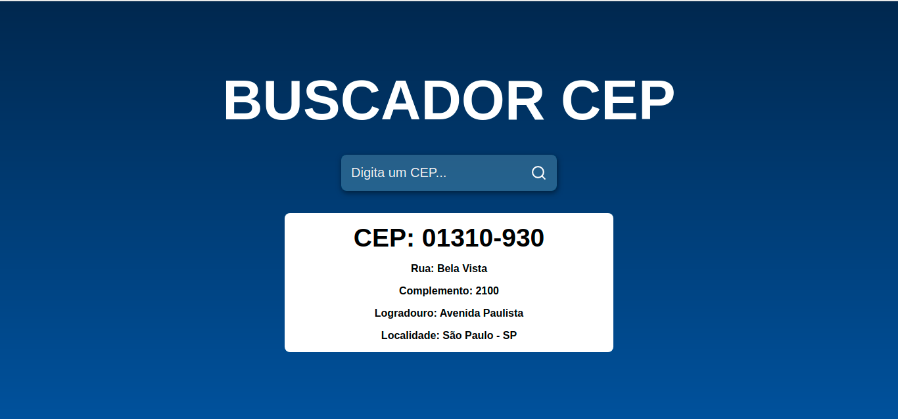

# BUSCADOR DE CEP

Buscador de CEP é um sistema que busca CEP, consumindo o serviço `https://viacep.com.br/`.

# Apresentação do projecto

### Tela Inicial

### CEP localizado

## FUNCINALIZADE DA APLICAÇÃO

- [x] Buscar cep 

## Desenvolvido por Miguel Leite

